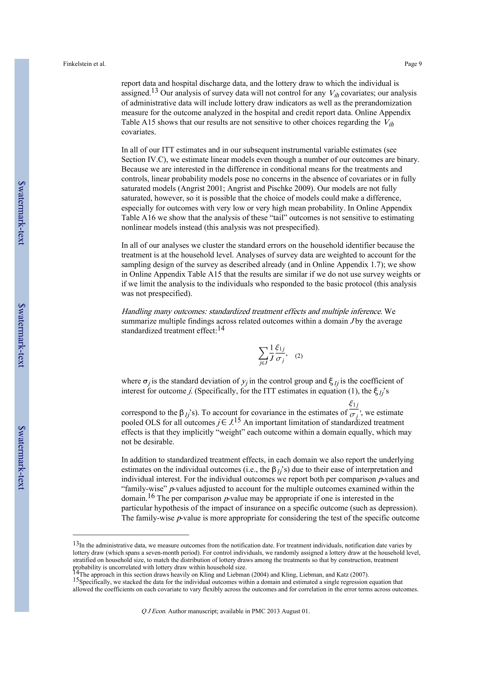

# 【提纲草稿】请修改后保存，再告诉我生成PPT

> ⚠️ 使用说明：
> 1. 修改各章节标题和要点内容
> 2. 图片已自动提取并嵌入，可删除不需要的图片行
> 3. 图片引用格式 `[图N,页P]` 必须保留（PPT生成器使用）
> 4. 修改完成后保存文件，告诉我「开始生成PPT」

## 基本信息
- 文章标题：THE OREGON HEALTH INSURANCE EXPERIMENT: EVIDENCE
- 汇报人：（请填写）
- 导师：（请填写）
- 汇报时间：（请填写）

## 提纲结构

### 1. 摘要
- In 2008, a group of uninsured low-income adults in Oregon was selected by lottery to be given the
chance to apply for Me...
- This lottery provides an opportunity to gauge the effects of
expanding access to public health insurance on the health c...
- In the year after random assignment, the
treatment group selected by the lottery was about 25 percentage points more lik...
- We find that in this first year, the treatment
group had substantively and statistically significantly higher health car...
- *We are grateful to Josh Angrist, Robert Avery, David Autor, Ethan Cohen-Cole, Carlos Dobkin, Esther Duflo, Jack Fowler,...
- We gratefully acknowledge funding from the Assistant Secretary for Planning
and Evaluation in the Department of Health a...
- MacArthur Foundation, the National Institute on Aging (P30AG012810, RC2AGO36631, and R01AG0345151), the Robert Wood
John...

<!-- 图片预览 -->

[图1,页1]

### 2. 研究背景与动机
- In early 2008, Oregon opened a waiting list for a limited number of spots in its Medicaid
program for low-income adults,...
- The
state drew names by lottery from the 90,000 people who signed up.
- This lottery presents an
opportunity to study the effects of access to public insurance using the framework of a
randomi...
- Although the effects of health insurance on health and health care use may seem intuitive,
and there have been hundreds ...
- Random assignment of health insurance to some
but not others would avoid such confounding, but such opportunities are ra...
- We present comparisons of outcomes between the treatment
group (those selected by the lottery who had an opportunity to ...
- We also present
estimates of the impact of insurance coverage, using the lottery as an instrument for
insurance coverage...
- We organize our analysis around the potential costs and benefits of health insurance.

### 3. 相关研究
- on the Oregon
Medicaid program and the lottery design.
- Section III describes the primary data sources, and
Section IV presents our empirical framework.
- Section V presents our main

### 4. 研究方法
- of Westfall and Young (1993); see Kling and Liebman (2004) or
Anderson (2008) for more detailed discussions as well as a...
- 17In the archived analysis plan we proposed presenting standardized treatment effects of related outcomes within a domai...
- Given the major substantive and methodological differences between the two types of data, in
this article we have opted ...
- In practice this makes a negligible difference to the adjusted p-values;

### 5. 材料合成与表征
- An Online Appendix for this article can be found at QJE online (qje.oxfordjournals.org).
- National Bureau of Economic Research and Massachusetts Institute of Technology
National Bureau of Economic Research
Cent...
- Author manuscript; available in PMC 2013 August 01.
- Published in final edited form as:
Q J Econ.
- 2012 August ; 127(3): 1057–1106.
- $watermark-text
$watermark-text
$watermark-text
I.

### 6. 实验与结果
- : EVIDENCE
FROM THE FIRST YEAR*
Amy Finkelstein, Sarah Taubman, Bill Wright, Mira Bernstein, Jonathan Gruber, Joseph P.
- Newhouse, Heidi Allen, Katherine Baicker, and Oregon Health Study Group

### 7. 核心结果
- in decreased exposure to medical liabilities
and out-of-pocket medical expenses, including a 6.4 percentage point (25%) ...
- Because much
medical debt is never paid, the financial incidence of expanded coverage thus appears to be
not only on the...
- Finally, we find that insurance is associated with improvements across the board in
measures of self-reported physical a...
- Two pieces of evidence suggest that the improvements in self-reported health
that we detect may at least partly reflect ...
- First,
evidence from a separate survey we conducted very shortly after random assignment shows
no impact of lottery sele...

<!-- 图片预览 -->

[图2,页9]

### 8. 分析与讨论
- of credit bureau data; much of our

### 9. 总结与展望
- expressed are solely those of the author(s) and do not represent the views of SSA, the National Institute on Aging, the
...
- In addition to the individuals
named as coauthors for this article, the Oregon Health Study Group includes Matt Carlson ...
- Author disclosures: Finkelstein served on the CBO’s Panel of Health Advisers through 2011.
- Wright is employed by Providence Health & Services, a nonprofit integrated health care delivery system.
- Gruber was a paid technical
consultant to the Obama administration during the development of the Affordable Care Act and...
- Newhouse is a director
of and holds equity in Aetna, which sells Medicaid policies, and serves on the CBO’s Panel of Hea...
- Allen is employed by
Providence Health and Services, a nonprofit integrated health care delivery system.
- She formerly served as director of the Medicaid
Advisory Committee and as staff to the Oregon Health Fund Board at the O...

---
## 附录：所有提取图片（供参考）

- **图1**（第1页）：`[图1,页1]`
  

- **图2**（第9页）：`[图2,页9]`
  
